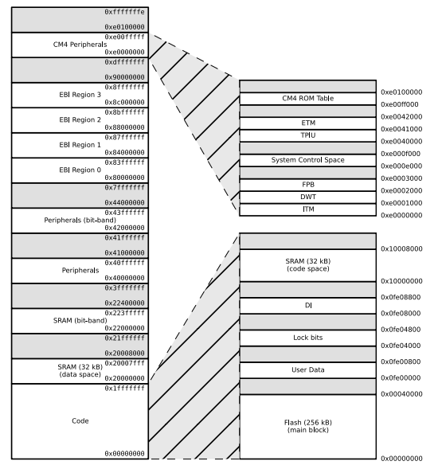
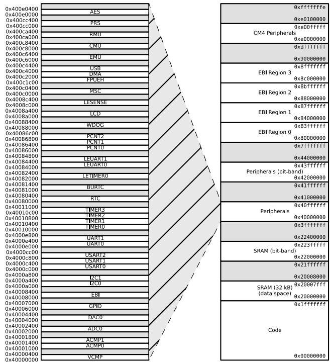
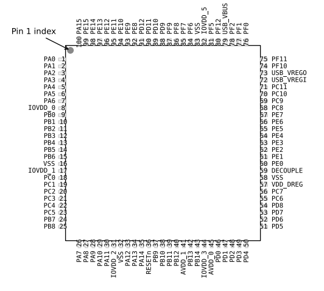
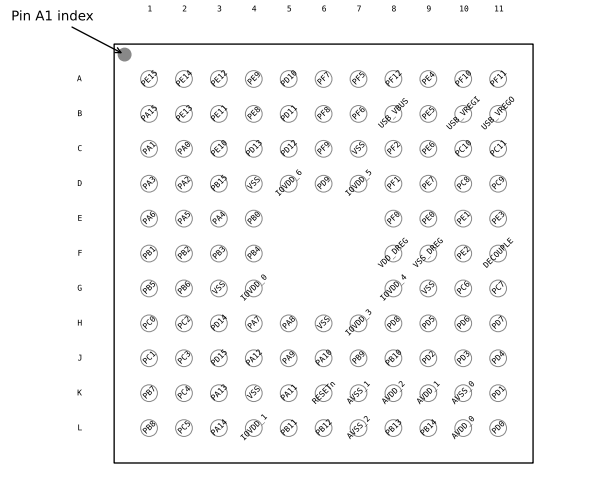
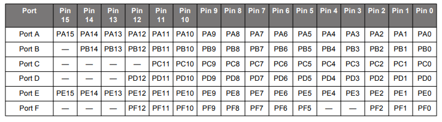
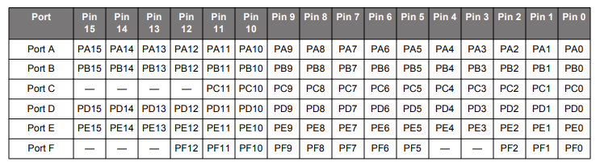
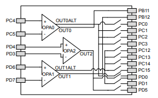
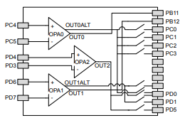

# EFM32

## Reference Documentation

* [Silicon Labs EFM32WG Reference Document](https://www.silabs.com/documents/public/reference-manuals/EFM32WG-RM.pdf)  
* [Silicon Labs EFM32WG Data Sheet](https://www.silabs.com/documents/public/data-sheets/efm32wg-datasheet.pdf)  
* [EFM32 STK 3800 User Guide](https://www.silabs.com/documents/public/user-guides/efm32wg-stk3800-ug.pdf) Note: this is a revision of 2400 Rev A.0.0

## Schematics

* [EFM32WG-STK Board BRD2400A Schematic (EFM32WG990F256 chip)](https://www.silabs.com/documents/public/schematic-files/EFM32WG-BRD2400A-A00-schematic.pdf) 
* [EFM32WG-DK Board BRD3800 A](https://www.silabs.com/documents/public/schematic-files/EFM32WG_BRD3800A_sch.pdf)  
* [EFM32WG-DK Main Board BRD3201 A](https://www.silabs.com/documents/public/schematic-files/DK_Main_BRD3201A_sch.pdf)
* [EFM32WG--DK Expansion Board BRD3500B](https://www.silabs.com/documents/public/schematic-files/DK_EXP_Proto_BRD3500B_sch.pdf)
* [AudioMoth Board 1.0.0 Schematic](Schematics/AudioMothSchematocv.1.0.0.svg)  Note: not current board  
* [AudioMoth Board @ CircuitHub](https://circuithub.com/projects/OpenAcoustics/AudioMoth)

## API 

* [EFM32 Wonder Gecko MCU and Peripheral Software Documentation - v5.8 - MCU ...
](https://docs.silabs.com/mcu/latest/efm32wg/)
  * \ Modules \ BSP
    * [Device Initialization](https://docs.silabs.com/mcu/latest/efm32wg/group-BSP-INIT)
  * \ Modules \ Devices
    * [EFM32WG](https://docs.silabs.com/mcu/latest/efm32wg/group-EFM32WG)
  * \ Modules \ EMLIB
    * [ACMP](https://docs.silabs.com/mcu/latest/efm32wg/group-ACMP)
    * [ADC](https://docs.silabs.com/mcu/latest/efm32wg/group-ADC)
    * [BURTC](https://docs.silabs.com/mcu/latest/efm32wg/group-BURTC)
    * [CMU](https://docs.silabs.com/mcu/latest/efm32wg/group-CMU)
    * [Common](https://docs.silabs.com/mcu/latest/efm32wg/group-COMMON)
    * [CORE](https://docs.silabs.com/mcu/latest/efm32wg/group-CORE)
    * [DMA](https://docs.silabs.com/mcu/latest/efm32wg/group-DMA)
    * [EMU](https://docs.silabs.com/mcu/latest/efm32wg/group-EMU)
    * [GPIO](https://docs.silabs.com/mcu/latest/efm32wg/group-GPIO)
    * [OPAMP](https://docs.silabs.com/mcu/latest/efm32wg/group-OPAMP)
    * [RMU](https://docs.silabs.com/mcu/latest/efm32wg/group-RMU)
    * [RTC](https://docs.silabs.com/mcu/latest/efm32wg/group-RTC)
    * [TIMER](https://docs.silabs.com/mcu/latest/efm32wg/group-TIMER)
    * [WDOG](https://docs.silabs.com/mcu/latest/efm32wg/group-WDOG)
  * \ Modules \ EMDRV
    * [DMADRV Direct Memory Access Driver](https://docs.silabs.com/mcu/latest/efm32wg/group-DMADRV)
    * [GPIOINT General Purpose Input/Output Interrupt dispatcher](https://docs.silabs.com/mcu/latest/efm32wg/group-GPIOINT)
    * [Sleep Management Driver](https://docs.silabs.com/mcu/latest/efm32wg/group-SLEEP)
    * [SPIDRV Serial Peripheral Interface Driver](https://docs.silabs.com/mcu/latest/efm32wg/group-SPIDRV)
    * [TEMPDRV Temperature Sensor Driver](https://docs.silabs.com/mcu/latest/efm32wg/group-TEMPDRV)
  * \ Modules \ Kit Drivers 
    * [Gecko USB MSDKit Drivers](https://docs.silabs.com/mcu/latest/efm32wg/group-Msd)
    * [MicroSdKit Drivers](https://docs.silabs.com/mcu/latest/efm32wg/group-MicroSd)
    * [SegmentLcdKit Drivers](https://docs.silabs.com/mcu/latest/efm32wg/group-SegmentLcd) Debugging 
  * \ Modules \ Platform Middleware
    * [GLIB](https://docs.silabs.com/mcu/latest/efm32wg/group-glib)
    * [USB](https://docs.silabs.com/mcu/latest/efm32wg/group-USB)
    * [USBXpress](https://docs.silabs.com/mcu/latest/efm32wg/group-usbxpress)

## Application Notes

* [AN0002.0: EFM32 and EFR32 Wireless Gecko Series 1 Hardware Design Considerations](https://www.silabs.com/documents/public/application-notes/an0002.1-efr32-efm32-series-0-hardware-design-considerations.pdf)
* [AN0002.1: EFM32 and EFR32 Wireless Gecko Series 1 Hardware Design Considerations](https://www.silabs.com/documents/public/application-notes/an0002.1-efr32-efm32-series-1-hardware-design-considerations.pdf)
* [AN0005: Real Time Counters](https://www.silabs.com/documents/public/application-notes/AN0005-EFM32-RTC.pdf)
* [AN0009.0: Getting Started with EFM32 and EFR32 Series 0](https://www.silabs.com/documents/public/application-notes/an0009.0-efm32-ezr32-series-0-getting-started.pdf)
* [AN0009.1: Getting Started with EFM32 and EFR32 Series 1](https://www.silabs.com/documents/public/application-notes/an0009.1-efr32-efm32-series-1-getting-started.pdf)
* [AN0011: I2C Master and Slave Operation](https://www.silabs.com/documents/public/application-notes/AN0011.pdf)
* [AN0012: General Purpose Input Output](https://www.silabs.com/documents/public/application-notes/an0012-efm32-gpio.pdf)
* [AN0013: Direct Memory Access](https://www.silabs.com/documents/public/application-notes/AN0013.pdf)
* [AN0014: EFM32 Timers](https://www.silabs.com/documents/public/application-notes/AN0014.pdf)
* [AN0015.0: EFM32 and EZR32 Wireless MCU Series 0 Watchdog](https://www.silabs.com/documents/public/application-notes/an0015.0-efm32-ezr32-series-0-watchdog.pdf)
* [AN0015.1: EFM32 and EFR32 Series 1 Watchdog](https://www.silabs.com/documents/public/application-notes/an0015.1-efr32-efm32-series-1-watchdog.pdf)
* [AN0020: Analog Comparator](https://www.silabs.com/documents/public/application-notes/AN0020.pdf)
* [AN0021: Analog to Digital Converter](https://www.silabs.com/documents/public/application-notes/AN0021.pdf)
* [AN0025: Peripheral Reflex System (PRS)](https://www.silabs.com/documents/public/application-notes/an0025-efm32-prs.pdf)
* [AN0027: Energy Optimization](https://www.silabs.com/documents/public/application-notes/an0027.pdf)
* [AN0030: FAT on SD Card](https://www.silabs.com/documents/public/application-notes/AN0030.pdf)
* [AN0034: External Bus Interface](https://www.silabs.com/documents/public/application-notes/an0034-efm32-ebi.pdf)
* [AN0038: Operational Amplifiers](https://www.silabs.com/documents/public/application-notes/AN0038.pdf)
* [AN0038.1: Operational Amplifiers (OPAMP)](https://www.silabs.com/documents/public/application-notes/an0038.1-efm32-series-1-operational-amplifiers.pdf)
* [AN0039: Interrupt Handling](https://www.silabs.com/documents/public/application-notes/AN0039.pdf)
* [AN0041: Backup Power Domain](https://www.silabs.com/documents/public/application-notes/AN0041.pdf)
* [AN0042: USB/UART Bootloader](https://www.silabs.com/documents/public/application-notes/an0042-efm32-usb-uart-bootloader.pdf)
* [AN0043: Debug and Trace](https://www.silabs.com/documents/public/application-notes/AN0043.pdf)
* [AN0046: USB Hardware Design Guide](https://www.silabs.com/documents/public/application-notes/AN0046.pdf)
* [AN0047: Interfacing Graphical Display](https://www.silabs.com/documents/public/application-notes/an0047-efm32-graphical-display.pdf)
* [AN0051: Digital Signal Processing with EFM32](https://www.silabs.com/documents/public/application-notes/AN0051.pdf)
* [AN0052: USB MSD Host Bootloader](https://www.silabs.com/documents/public/application-notes/AN0052.pdf)
* [AN1029: Linked Direct Memory Access
(LDMA) Controller](https://www.silabs.com/documents/public/application-notes/AN1029-efm32-ldma.pdf)
* [AN0065: EFM32 as USB Device](https://www.silabs.com/documents/public/application-notes/AN0065.pdf)
* [AN1204: USB Device/Host MSD Application Bootloader](https://www.silabs.com/documents/public/application-notes/an1204-efm32-usb-msd-application-bootloader.pdf)

## Device Specific Details

| Module | 990 Configuration | 990 Pin Connections | 380 Configuration | 380 Pin Connections |
| -----|  ----- | ----- | ----- | ------ |
| Cortex-M4 | Full configuration | NA |Full configuration| NA
DBG |Full configuration |DBG_SWCLK, DBG_SWDIO, DBG_SWO | Full configuration | DBG_SWCLK, DBG_SWDIO, DBG_SWO
MSC |Full configuration |NA |Full configuration |NA
DMA |Full configuration |NA|Full configuration |NA
RMU |Full configuration |NA|Full configuration |NA
EMU| Full configuration |NA|Full configuration |NA
CMU |Full configuration| CMU_OUT0, CMU_OUT1 | Full configuration| CMU_OUT0, CMU_OUT1
WDOG |Full configuration |NA|Full configuration |NA
PRS |Full configuration| NA|Full configuration |NA
USB |Full configuration| USB_VBUS, USB_VBUSEN, USB_VREGI, USB_VREGO, USB_DM, USB_DMPU, USB_DP, USB_ID | Full configuration | USB_VBUS, USB_VBUSEN, USB_VREGI, USB_VREGO, USB_DM, USB_DMPU, USB_DP, USB_ID
EBI |Full configuration| EBI_A[27:0], EBI_AD[15:0], EBI_ARDY, EBI_ALE, EBI_BL[1:0], EBI_CS[3:0], EBI_CSTFT, EBI_DCLK, EBI_DTEN, EBI_HSNC, EBI_NANDREn, EBI_NANDWEn, EBI_REn, EBI_VSNC, EBI_WEn | Full configuration | EBI_A[27:0], EBI_AD[15:0], EBI_ARDY, EBI_ALE, EBI_BL[1:0], EBI_CS[3:0], EBI_CSTFT, EBI_DCLK, EBI_DTEN, EBI_HSNC, EBI_NANDREn, EBI_NANDWEn, EBI_REn, EBI_VSNC, EBI_WEn
I2C0 |Full configuration |I2C0_SDA, I2C0_SCL|Full configuration |I2C0_SDA, I2C0_SCL
I2C1 |Full configuration |I2C1_SDA, I2C1_SCL|Full configuration |I2C1_SDA, I2C1_SCL
USART0 |Full configuration with IrDA | US0_TX, US0_RX. US0_CLK, US0_CS|Full configuration with IrDA | US0_TX, US0_RX. US0_CLK, US0_CS
USART1 |Full configuration with I2S |US1_TX, US1_RX, US1_CLK, US1_CS |Full configuration with I2S |US1_TX, US1_RX, US1_CLK, US1_CS
USART2 |Full configuration with I2S |US2_TX, US2_RX, US2_CLK, US2_CS |Full configuration with I2S |US2_TX, US2_RX, US2_CLK, US2_CS
UART0 |Full configuration |U0_TX, U0_RX|Full configuration |U0_TX, U0_RX
UART1 |Full configuration |U1_TX, U1_RX|Full configuration |U1_TX, U1_RX
LEUART0 |Full configuration |LEU0_TX, LEU0_RX|Full configuration |LEU0_TX, LEU0_RX
LEUART1 |Full configuration |LEU1_TX, LEU1_RX|Full configuration |LEU1_TX, LEU1_RX
TIMER0 |Full configuration| with DTI TIM0_CC[2:0], TIM0_CDTI[2:0]|Full configuration| with DTI TIM0_CC[2:0], TIM0_CDTI[2:0]
TIMER1 |Full configuration |TIM1_CC[2:0]|Full configuration |TIM1_CC[2:0]
TIMER2 |Full configuration| TIM2_CC[2:0]|Full configuration| TIM2_CC[2:0]
TIMER3 |Full configuration |TIM3_CC[2:0] |Full configuration |TIM3_CC[2:0]
RTC |Full configuration |NA |Full configuration |NA
BURTC |Full configuration |NA |Full configuration |NA
LETIMER0 |Full configuration |LET0_O[1:0]|Full configuration |LET0_O[1:0]
PCNT0 |Full configuration, 16-bit count register |PCNT0_S[1:0] |Full configuration, 16-bit count register |PCNT0_S[1:0]
PCNT1 |Full configuration, 8-bit count register |PCNT1_S[1:0]|Full configuration, 8-bit count register |PCNT1_S[1:0]
PCNT2 |Full configuration, 8-bit count register |PCNT2_S[1:0]|Full configuration, 8-bit count register |PCNT2_S[1:0]
ACMP0 |Full configuration |ACMP0_CH[7:0], ACMP0_O|Full configuration |ACMP0_CH[7:0], ACMP0_O
ACMP1 |Full configuration |ACMP1_CH[3:0], ACMP1_O|Full configuration |ACMP1_CH[3:0], ACMP1_O
VCMP |Full configuration |NA |Full configuration |NA
ADC0 |Full configuration |ADC0_CH[7:0]|Full configuration |ADC0_CH[7:0]
DAC0 |Full configuration| DAC0_OUT[1:0], DAC0_OUTxALT|Full configuration| DAC0_OUT[1:0], DAC0_OUTxALT
OPAMP| Full configuration |Outputs: OPAMP_OUTx, OPAMP_OUTxALT, Inputs: OPAMP_Px, OPAMP_Nx | Full configuration | Outputs: OPAMP_OUTx, OPAMP_OUTxALT, Inputs: OPAMP_Px, OPAMP_Nx
AES |Full configuration |NA |Full configuration |NA
GPIO |81 pins Available pins are shown in 5.20.3 |GPIO Pinout Overview | 83 pins Available pins are shown in 5.9.3 | GPIO Pinout Overview
LCD |Full configuration |LCD_SEG[33:0], LCD_COM[7:0], LCD_BCAP_P, LCD_BCAP_N, LCD_BEXT

## System Address Space with Code Listing Space

## System Address Space with Peripheral Listing

## Chips

|EFM32WG Part #|Flash|RAM|GPIO(pins)|USB|LCD|USART+UART|LEUART|I2C|Timer(PWM)|LETIMER|RTC|PCNT|Watchdog|ADC(pins)|DAC(pins)|ACMP(pins)|AES|EBI|LESENSE|Op—Amps|Package|
|-----|-----|-----|-----|-----|-----|-----|-----|-----|-----|-----|-----|-----|-----|-----|-----|-----|-----|-----|-----|-----|-----|
| 380F256 |256 |32 |83 |Y |— |3+2 |2 |2 |4 (12) |1 |1 |3 |1 |1 (8)| 2 (2) |2 (12) | Y |Y |Y |3 | QFP100
| 990F256 |256 |32 |87 |Y |8x34 |3+2 |2 |2 |4 (12) |1 |1 |3 |1 |1 (8) | 2 (2) |  2 (12) | Y |Y1 |Y |3 | LFBGA112

## Pinout
|EFM32WG380|EFM32WG990|
|-----|-----|
|  | |

## GPIO Pinout 
| Chip |  Pins |
|-----|-----|
| EFM32WG380 | |
| EFM32WG990 | |

## OpAmp

|EFM32WG380|EFM32WG990|
|-----|-----|
|  | |

